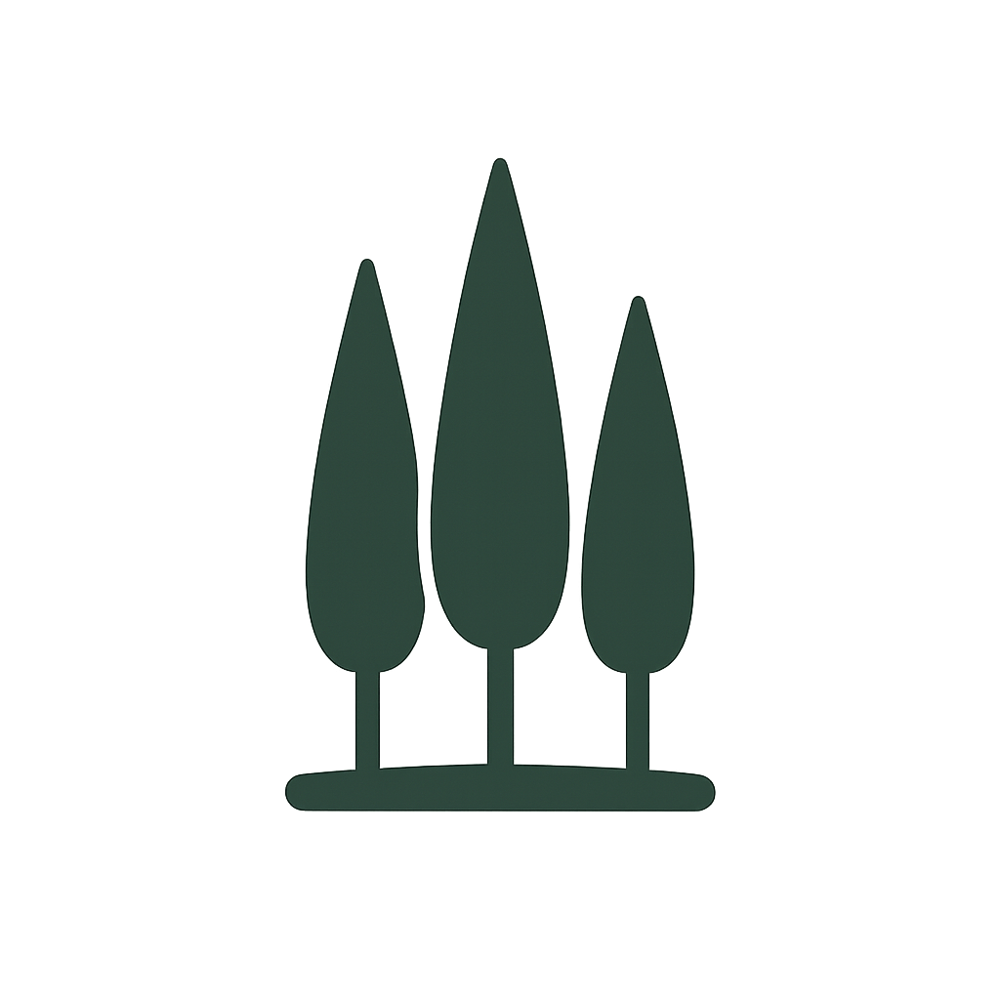

# 🌲 Grove

A beautiful, lightweight markdown notes app with a VS Code-inspired interface. Organize your thoughts in a personal knowledge grove.



## Features

### 📝 Editor
- **Markdown editor** with live preview (edit, split, or preview mode)
- **Markdown toolbar** — Bold, italic, headings, lists, checkboxes, links, images, code blocks, blockquotes, wikilinks
- **Auto-save** with 2-second debounce — never lose work
- **Frontmatter preview** — read-only view of YAML frontmatter (managed by Grove)
- **Wikilinks** — clickable `[[note]]` links to navigate between notes
- **Image paste** — paste images from clipboard directly into the editor
- **Image upload** — upload via toolbar button or drag & drop

### 📂 File Management
- **File tree** sidebar with folder navigation — shows all files (markdown, images, PDFs, etc.)
- **Drag & drop** files and folders to reorganize
- **Import** — drop `.md` or `.txt` files to import into your vault
- **Recent files** panel for quick access
- **Search** by note name or content
- **Create, rename, delete** notes and folders
- **Asset files** — images, PDFs, audio/video shown with type-specific icons

### 🏷️ Organization
- **Tag management** — add/remove tags via modal, stored as YAML frontmatter
- **Tag filter** — filter notes by tag from the sidebar dropdown
- **Daily notes** — one-click daily log creation using customizable template
- **Templates** — create, edit, and delete body-only note templates (Grove manages frontmatter)
- **Document types** — auto-set `type` in frontmatter based on template (meeting, decision, research, reflection, execution, daily, note)
- **Todo dashboard** — scan all notes for checkboxes, toggle completion, click to navigate to source note
- **Auto-slug headings** — H2/H3 automatically get `{#slug}` anchors on save for LLM-friendly chunking

### 👥 Contacts
- **Contact management** — full CRUD with fields: ID, first name, last name, email, company, template
- **@ mention autocomplete** — type `@` in the editor to search and insert contacts
- **Template substitution** — each contact has a configurable template with placeholders: `{{id}}`, `{{first_name}}`, `{{last_name}}`, `{{email}}`, `{{company}}`
- **Default template** — configurable per-vault in `.grove/config.json`
- **Import contacts** — bulk import from JSON file

### 🗄️ Multi-Vault
- **Multiple vaults** — create and switch between vaults (e.g., personal, work)
- **Vault selector** — dropdown in the sidebar toolbar
- **Per-vault config** — each vault has its own `.grove/config.json`
- **Per-vault templates** — each vault has its own `.templates/` directory
- **Per-vault contacts** — each vault has its own `.grove/contacts.json`

### 📤 Share
- **Print / Save as PDF** — clean, formatted print view
- **Email** — opens mail client with note content
- **Copy as Markdown** — raw markdown to clipboard
- **Copy as HTML** — rendered HTML to clipboard (paste into Gmail, Docs, etc.)

### 🖼️ Images & Attachments
- **Paste from clipboard** — Ctrl+V an image, auto-uploads to `attachments/`
- **Toolbar upload** — click the image icon to pick a file
- **File serving** — `GET /api/file/<path>` serves any file from the vault
- **Tree integration** — click an image in the tree to copy its markdown reference
- **Supported formats** — PNG, JPG, JPEG, GIF, WEBP, SVG, PDF, MP3, MP4, WAV

### 🎨 Appearance
- **Soft green theme** — dark and light modes with CSS variables
- **Theme toggle** — top-right button to switch between dark and light
- **Fullscreen mode** — distraction-free writing (F11 or Escape to exit)
- **Collapsible sidebar** — more room for writing
- **Welcome splash** — quick actions when no note is selected
- **Mobile responsive** — hamburger menu, touch-friendly buttons, works on iPhone/Android

### ⌨️ Keyboard Shortcuts

| Shortcut | Action |
|----------|--------|
| `Ctrl+S` | Save note |
| `Ctrl+N` | New note |
| `Ctrl+P` | Toggle preview |
| `Ctrl+K` | Focus search |
| `Ctrl+B` | Bold |
| `Ctrl+I` | Italic |
| `Ctrl+L` | Insert link |
| `Ctrl+M` | New meeting note |
| `Ctrl+V` | Paste image from clipboard |
| `F2` | Rename note |
| `Delete` | Delete note |
| `F11` | Toggle fullscreen |
| `Escape` | Exit fullscreen |
| `@` | Trigger contact autocomplete |

## Installation

### Prerequisites
- Python 3.8+
- pip

### Quick Start

```bash
# Clone the repository
git clone https://github.com/blanzp/mdvault-web.git
cd mdvault-web

# Create virtual environment
python3 -m venv venv
source venv/bin/activate  # Linux/Mac
# or: venv\Scripts\activate  # Windows

# Install dependencies
pip install -r requirements.txt

# Run the app
python app.py
```

The app starts at **http://localhost:5000**

### Running on a Network

By default, Grove binds to `0.0.0.0:5000`, so it's accessible from other devices on your network. Open `http://<your-ip>:5000` on your phone or tablet.

## Usage

### Creating Notes
1. Click the **📄 file icon** in the sidebar toolbar
2. Enter a title, optional tags, and select a template
3. Click **Create**

Notes without a template get `type: note`. Notes created from a template get the matching type (e.g., `type: meeting`).

### Daily Notes
Click the **📅 calendar icon** to create today's note in the `daily/` folder. Uses `vault/.templates/daily.md` if it exists, with `type: daily` in frontmatter.

### Meeting Notes
Click the **🤝 handshake icon** for a quick meeting note with timestamp title (e.g., "Meeting 2026-02-14 1300") using the meeting template.

### Templates
Manage templates from the **📋 template icon** in the sidebar toolbar.

Templates are **body-only** — Grove manages all frontmatter (title, created, type, tags).

**Template placeholders:**
- `{{title}}` — Note title
- `{{date}}` — Current date (ISO format)

**Standard templates included:**
- `meeting` — Attendees, Agenda, Notes, Action Items
- `decision` — Context, Options, Decision, Rationale, Consequences
- `research` — Question/Hypothesis, Background, Findings, References
- `reflection` — What happened, What went well, What could be better, Lessons learned

**Example template** (`vault/.templates/meeting.md`):
```markdown
# {{title}}

## Attendees

## Agenda

## Notes

## Action Items

- [ ]
```

### Frontmatter
Grove exclusively manages YAML frontmatter. You cannot edit it directly — use the **📜 scroll icon** to preview it read-only. Frontmatter includes:

- `title` — Note title
- `created` — ISO timestamp
- `type` — Document type (note, meeting, decision, research, reflection, execution, daily)
- `tags` — YAML array of tags

### Contacts
Click the **📒 address book icon** to manage contacts.

**Fields:** ID, first name, last name, email, company, template

**@ Autocomplete:** Type `@` in the editor and start typing. Arrow keys to navigate, Enter/Tab to insert. The contact's template is rendered with field substitution.

**Default template:** Configure in `vault/.grove/config.json`:
```json
{
  "default_contact_template": "http://phone.google.com/{{id}}"
}
```

**Template placeholders:** `{{id}}`, `{{first_name}}`, `{{last_name}}`, `{{email}}`, `{{company}}`

**Bulk import:** Click "Import JSON" and upload a file:
```json
[
  {"id": "12345", "first_name": "Jane", "last_name": "Smith", "email": "jane@example.com", "company": "Acme"}
]
```

### Multi-Vault
Use the **vault selector** dropdown in the sidebar toolbar to switch vaults. Click the **folder+ icon** next to it to create a new vault.

Vaults are stored under `vaults/` (except the default `vault/` directory). Each vault has its own notes, templates, contacts, and config.

### Images & Attachments
- **Paste:** Ctrl+V an image from clipboard — auto-uploads to `vault/attachments/`
- **Toolbar:** Click the image icon → pick a file → uploads and inserts markdown
- **Reference:** ``
- **Tree:** Click an image in the file tree to copy its markdown reference

### Todo Dashboard
Click the **✅ tasks icon** to see all checkboxes across your vault. Toggle completion directly from the dashboard — changes sync back to the source note.

Checkboxes use standard markdown format: `- [ ] Task` / `- [x] Done`

### Share
Click the **📤 share icon** when viewing a note:
- **Print / PDF** — opens a print-friendly window
- **Email** — opens mail client with title and content
- **Copy Markdown** — raw markdown to clipboard
- **Copy HTML** — rendered HTML to clipboard

### Search
- `Ctrl+K` to focus the search bar
- Type and press Enter to search
- Use the tag dropdown to filter by tag
- Click the **✕** button to clear search

## Configuration

### Per-Vault Config (`vault/.grove/config.json`)
```json
{
  "default_contact_template": "[{{first_name}} {{last_name}}](mailto:{{email}})"
}
```

### Global Config (`.grove/config.json`)
```json
{
  "active_vault": "vault"
}
```

## File Structure

```
grove/
├── app.py                  # Flask backend
├── requirements.txt        # Python dependencies
├── .grove/
│   └── config.json         # Global config (active vault)
├── vault/                  # Default vault
│   ├── .grove/
│   │   ├── config.json     # Per-vault config
│   │   └── contacts.json   # Contacts database
│   ├── .templates/         # Note templates (body-only)
│   ├── attachments/        # Uploaded images & files
│   └── daily/              # Daily notes
├── vaults/                 # Additional vaults
│   ├── personal/
│   └── work/
├── static/
│   ├── css/
│   │   ├── style.css       # Main styles + CSS variables
│   │   └── theme.css       # Theme-specific overrides
│   ├── js/
│   │   └── app.js          # Frontend application
│   ├── grove-logo.png      # App logo
│   └── favicon.ico         # Browser favicon
└── templates/
    └── index.html          # Main HTML template
```

## API Endpoints

| Method | Endpoint | Description |
|--------|----------|-------------|
| **Notes** | | |
| `GET` | `/api/tree` | Get vault directory tree (all files) |
| `GET` | `/api/note/<path>` | Get note content + metadata |
| `PUT` | `/api/note/<path>` | Save note content (auto-slugs H2/H3) |
| `POST` | `/api/note` | Create new note (with optional template) |
| `DELETE` | `/api/note/<path>` | Delete a note |
| `PUT` | `/api/note/<path>/tags` | Update note tags |
| `PUT` | `/api/note/<path>/rename` | Rename a note |
| **Folders** | | |
| `POST` | `/api/folder` | Create new folder |
| `POST` | `/api/move` | Move a file |
| `POST` | `/api/move-folder` | Move a folder |
| `POST` | `/api/rename` | Rename a file |
| **Daily & Templates** | | |
| `POST` | `/api/daily` | Create daily note |
| `GET` | `/api/templates` | List templates |
| `POST` | `/api/template` | Create template |
| `PUT` | `/api/template/<name>` | Update template |
| `DELETE` | `/api/template/<name>` | Delete template |
| **Search & Tags** | | |
| `GET` | `/api/search?q=<query>&tag=<tag>` | Search notes |
| `GET` | `/api/tags` | Get all tags with counts |
| **Todos** | | |
| `GET` | `/api/todos` | Get all checkboxes across vault |
| `POST` | `/api/toggle-todo` | Toggle a checkbox |
| **Files & Images** | | |
| `GET` | `/api/file/<path>` | Serve any file from vault |
| `POST` | `/api/upload` | Upload file (multipart form) |
| `POST` | `/api/upload/paste` | Upload pasted image (base64) |
| **Contacts** | | |
| `GET` | `/api/contacts` | List all contacts |
| `POST` | `/api/contacts` | Add a contact |
| `PUT` | `/api/contacts/<id>` | Update a contact |
| `DELETE` | `/api/contacts/<id>` | Delete a contact |
| `POST` | `/api/contacts/import` | Bulk import contacts (JSON array) |
| **Vaults** | | |
| `GET` | `/api/vaults` | List vaults + active vault |
| `POST` | `/api/vaults/create` | Create new vault |
| `POST` | `/api/vaults/switch` | Switch active vault |
| **Config** | | |
| `GET` | `/api/config` | Get per-vault config |
| `PUT` | `/api/config` | Update per-vault config |

## Tech Stack

- **Backend:** Flask (Python)
- **Frontend:** Vanilla JavaScript (no frameworks)
- **Markdown Rendering:** [Marked.js](https://marked.js.org/) v4.3.0
- **Icons:** [Font Awesome](https://fontawesome.com/) 6.4.0
- **Styling:** CSS custom properties for theming

## License

MIT
